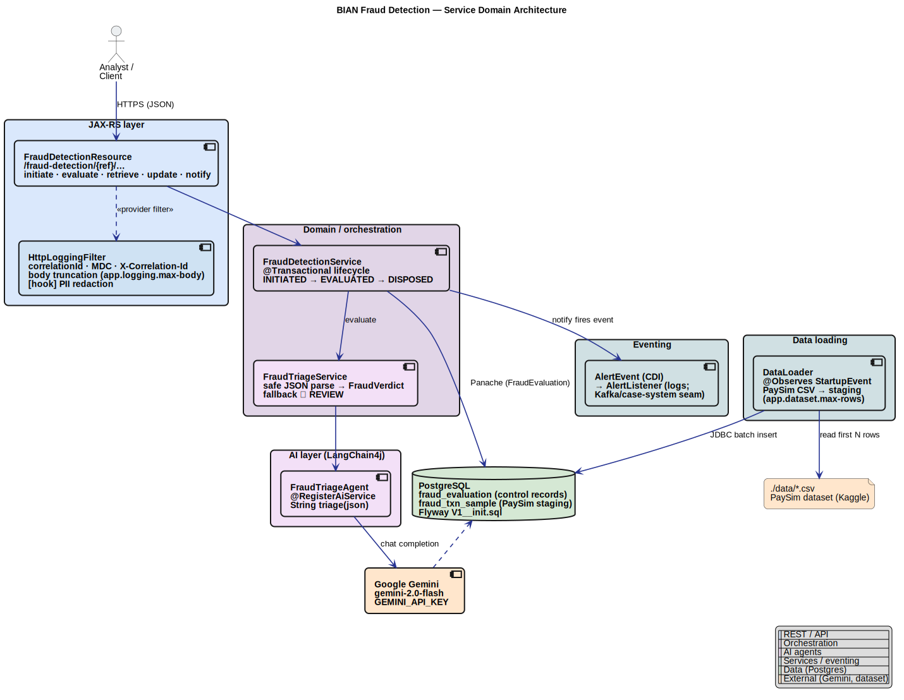
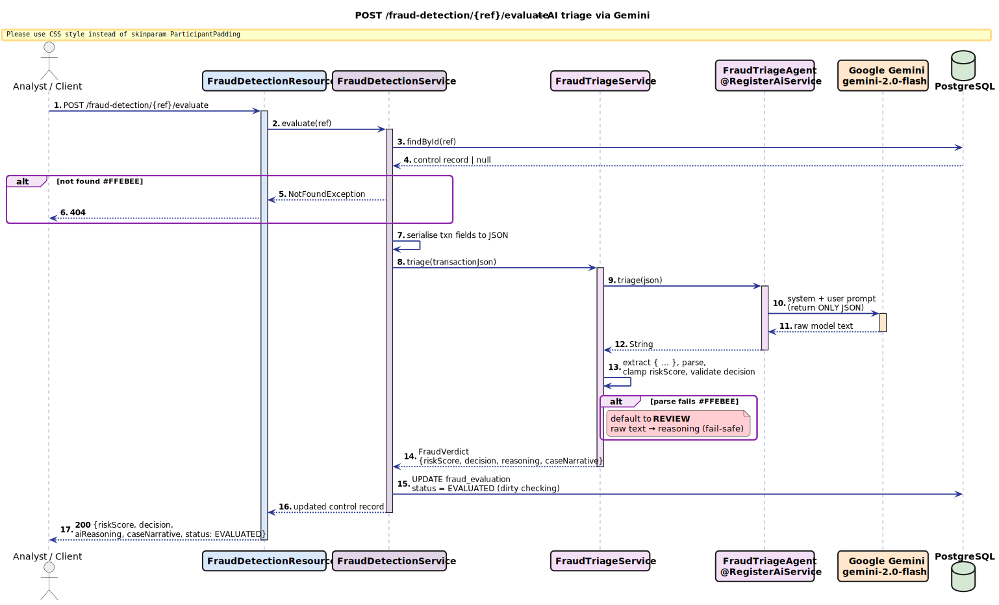
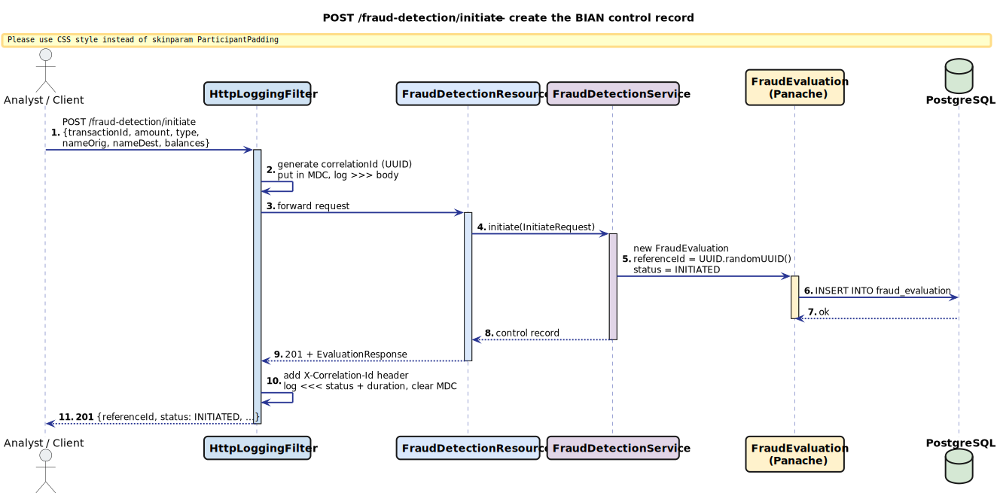
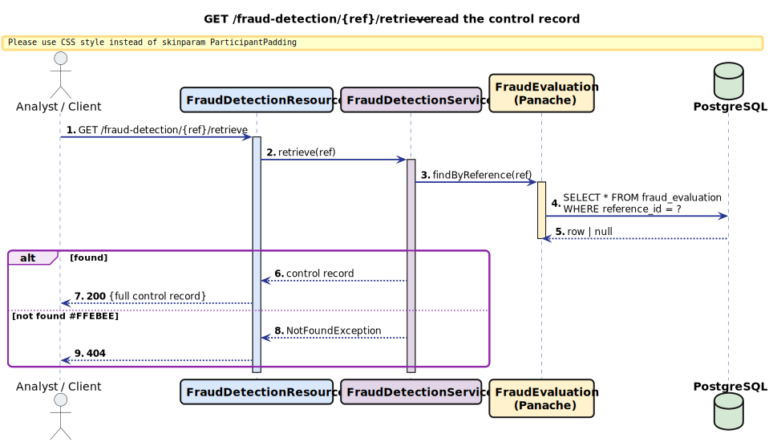
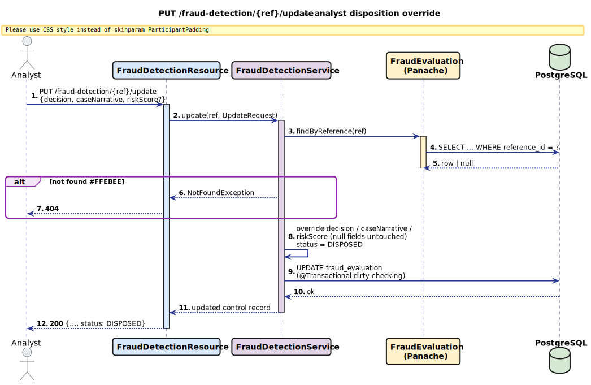
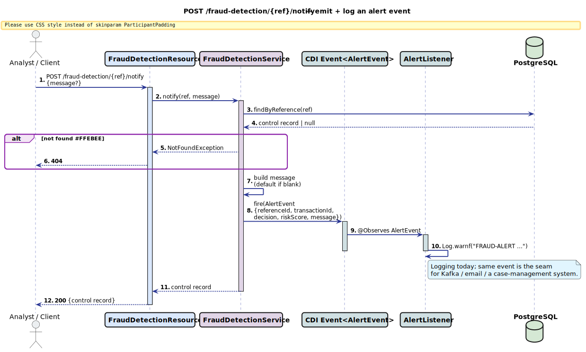

# bian-fraud-detection

[](https://github.com/ksktechai/bian-fraud-detection/actions/workflows/ci.yml)

A **BIAN Fraud Detection service domain** built on Quarkus. It exposes the BIAN verb
vocabulary over a `FraudEvaluation` control record and runs AI triage against
**Google Gemini** (`gemini-2.0-flash`) via LangChain4j. Transactions are sourced from the
PaySim synthetic dataset. (The provider is swappable to a local Ollama model — see
[Switching the LLM provider](#switching-the-llm-provider).)

- **Java:** OpenJDK 25 (`maven.compiler.release=25`)
- **Quarkus:** 3.33.2 (LTS), `io.quarkus.platform` BOM
- **Group / Artifact:** `nz.co.ksktech` / `bian-fraud-detection`
- **Package root:** `nz.co.ksktech.fraud`

---

## Architecture at a glance

```
POST /fraud-detection/initiate          create control record  -> INITIATED
POST /fraud-detection/{ref}/evaluate    AI triage (Gemini)      -> EVALUATED
GET  /fraud-detection/{ref}/retrieve    read control record
PUT  /fraud-detection/{ref}/update      analyst override        -> DISPOSED
POST /fraud-detection/{ref}/notify      emit + log alert event
```

- **`FraudEvaluation`** — JPA/Panache entity, the BIAN control record (`reference_id` UUID).
- **`FraudTriageAgent`** — `@RegisterAiService` (Gemini). Returns raw model text.
- **`FraudTriageService`** — safely parses the model output into a `FraudVerdict`;
  on any parse failure it degrades to `REVIEW` and stores the raw text in `reasoning`.
- **`DataLoader`** — on startup, streams the first `app.dataset.max-rows` PaySim rows from
  `app.dataset.path/*.csv` into the `fraud_txn_sample` staging table (skipped if already
  populated, or when `app.dataset.enabled=false`).
- **`HttpLoggingFilter`** — logs every request/response with a per-request `correlationId`
  (MDC + `X-Correlation-Id` response header), bodies truncated to `app.logging.max-body`.
- **Flyway `V1__init.sql`** owns the schema (`quarkus.hibernate-orm.database.generation=none`).

### Architecture diagram



*Editable source: [`docs/architecture.puml`](docs/architecture.puml) — re-render with
`plantuml -tsvg -o . docs/architecture.puml` (`brew install plantuml`).*

### Sequence diagrams

One per BIAN endpoint, sources in [`docs/sequence/`](docs/sequence/) (PlantUML) with
pre-rendered SVGs in `docs/sequence/rendered/`. Re-render with
`plantuml -tsvg -o rendered docs/sequence/*.puml` or the IntelliJ/VS Code PlantUML plugin.

Colour key (all diagrams): blue = REST API, purple = orchestration/AI agents, yellow =
Panache entities, green = data (Postgres), cyan = services/eventing, orange = external
(Gemini), red = not-found / fail-safe paths.

#### `POST /fraud-detection/{ref}/evaluate` — AI triage pipeline



<details>
<summary><b><code>POST /fraud-detection/initiate</code></b> — create the control record</summary>


</details>

<details>
<summary><b><code>GET /fraud-detection/{ref}/retrieve</code></b> — read the control record</summary>


</details>

<details>
<summary><b><code>PUT /fraud-detection/{ref}/update</code></b> — analyst disposition override</summary>


</details>

<details>
<summary><b><code>POST /fraud-detection/{ref}/notify</code></b> — emit + log an alert event</summary>


</details>

---

## Prerequisites

1. **JDK 25** — `java -version` should report `25.x`.
2. **Docker** (for local Postgres, and for the test suite's Dev Services).
3. **A Google Gemini API key** (free tier): get one at
   <https://aistudio.google.com/apikey>, then put it in a local `.env` (gitignored;
   Quarkus loads it automatically in dev):
   ```bash
   cp .env.example .env
   # edit .env and set GEMINI_API_KEY=...
   ```
4. **Postgres** running on `localhost:5434` (db/user/pass = `fraud`):
   ```bash
   docker compose up -d
   ```

### PaySim dataset (Kaggle)

The PaySim "Synthetic Financial Datasets For Fraud Detection" CSV is ~470 MB and is **not**
committed. Download it and drop the CSV into `./data/`:

1. Create a Kaggle account and an API token (`Account → Create New API Token`),
   which downloads `kaggle.json` to `~/.kaggle/kaggle.json` (`chmod 600`).
2. Install the CLI and download:
   ```bash
   pip install kaggle
   kaggle datasets download -d ealaxi/paysim1 -p ./data
   unzip ./data/paysim1.zip -d ./data
   ```
   You should end up with a file like
   `./data/PS_20174392719_1491204439457_log.csv`.

   (Or download manually from <https://www.kaggle.com/datasets/ealaxi/paysim1> and unzip
   into `./data/`.)

The loader reads **any** `*.csv` in `./data` with the PaySim header
`step,type,amount,nameOrig,oldbalanceOrg,newbalanceOrig,nameDest,oldbalanceDest,newbalanceDest,isFraud,isFlaggedFraud`.

---

## Run

```bash
docker compose up -d          # Postgres on :5434
# GEMINI_API_KEY comes from .env (see Prerequisites)
./mvnw quarkus:dev            # app on :8080  (Flyway migrates, DataLoader stages CSV)
```

- Swagger UI: <http://localhost:8080/q/swagger-ui>
- Health: <http://localhost:8080/q/health>

### Configuration knobs

| Property                    | Default                              | Env override        |
|-----------------------------|--------------------------------------|---------------------|
| `app.dataset.path`          | `./data`                             | `DATASET_PATH`      |
| `app.dataset.max-rows`      | `100000`                             | `DATASET_MAX_ROWS`  |
| `app.dataset.enabled`       | `true` (`false` in test)             | `DATASET_ENABLED`   |
| `app.logging.max-body`      | `2000`                               | `LOG_MAX_BODY`      |
| Gemini API key              | _(none — required)_                  | `GEMINI_API_KEY`    |
| Gemini chat model           | `gemini-2.0-flash`                   | `GEMINI_MODEL`      |
| JDBC URL                    | `jdbc:postgresql://localhost:5434/fraud` | `DB_URL`        |

### Switching the LLM provider

The `FraudTriageAgent` runs on **Gemini** (`quarkus-langchain4j-ai-gemini`) by default. To run
fully offline against a local **Ollama** model instead:

1. In `pom.xml`, uncomment the `quarkus-langchain4j-ollama` dependency.
2. In `application.properties`, comment out the `quarkus.langchain4j.ai.gemini.*` block and
   uncomment the `quarkus.langchain4j.ollama.*` block.
3. Set `OLLAMA_BASE_URL` / `OLLAMA_CHAT_MODEL` in `.env`, and `ollama pull qwen3:30b`.

No Java changes are needed — the agent interface is provider-agnostic.

---

## Example calls (BIAN endpoints)

A ready-made **Postman collection** lives at
[`docs/postman/bian-fraud-detection.postman_collection.json`](docs/postman/bian-fraud-detection.postman_collection.json)
— import it via *Postman → Import → File*. It is organised into folders (33 requests):

| Folder | What it covers |
|---|---|
| **01 Lifecycle** | the canonical chain: initiate → evaluate → retrieve → update → notify |
| **02 Initiate variations** | TRANSFER drain, large CASH_OUT, small PAYMENT, DEBIT, CASH_IN |
| **03 Evaluate scenarios** | self-contained *seed → evaluate* flows (high-risk drain, large cash-out, low-risk payment, re-evaluate) |
| **04 Update variations** | analyst override to CLEAR / BLOCK / REVIEW |
| **05 Notify variations** | default alert message vs. custom escalation |
| **06 Error cases** | every operation on an unknown reference → 404 |

`initiate` requests capture the returned `referenceId` into the `{{ref}}` collection variable
(via a test script), so the following requests chain; `{{baseUrl}}` defaults to `localhost:8080`.
Each request carries `pm.test` assertions, so the whole collection runs green in the Collection
Runner. Or use the equivalent curl commands below.

### 1. Initiate — create a control record
```bash
REF=$(curl -s -X POST http://localhost:8080/fraud-detection/initiate \
  -H 'Content-Type: application/json' \
  -d '{
        "transactionId": "TXN-1001",
        "amount": 181.00,
        "type": "TRANSFER",
        "nameOrig": "C1231006815",
        "nameDest": "C1979787155",
        "oldbalanceOrg": 181.00,
        "newbalanceOrig": 0.00
      }' | jq -r .referenceId)
echo "ref=$REF"
```

### 2. Evaluate — run AI triage (Gemini)
```bash
curl -s -X POST http://localhost:8080/fraud-detection/$REF/evaluate | jq
# -> riskScore, decision (CLEAR|REVIEW|BLOCK), aiReasoning, caseNarrative, status=EVALUATED
```

### 3. Retrieve — read the control record
```bash
curl -s http://localhost:8080/fraud-detection/$REF/retrieve | jq
```

### 4. Update — analyst disposition override
```bash
curl -s -X PUT http://localhost:8080/fraud-detection/$REF/update \
  -H 'Content-Type: application/json' \
  -d '{"decision":"CLEAR","caseNarrative":"Confirmed legitimate with customer.","riskScore":5}' | jq
# -> status=DISPOSED
```

### 5. Notify — emit + log an alert event
```bash
curl -s -X POST http://localhost:8080/fraud-detection/$REF/notify \
  -H 'Content-Type: application/json' \
  -d '{"message":"Escalated to financial crime team."}' | jq
```

Every response carries an `X-Correlation-Id` header; the same id is on every server log line
for that request (`[...]`).

---

## Tests

```bash
./mvnw test
```

**Integration tests** (`@QuarkusTest`):
- `FraudDetectionResourceTest` — initiate, retrieve, update (analyst override → DISPOSED),
  notify (default + custom message), and the 404 paths for every operation.
- `FraudEvaluateTest` — mocks the `FraudTriageAgent` **bean** and asserts `evaluate` sets
  `riskScore` + `decision` (and that unparseable output falls back to `REVIEW`).
- `FraudTriageWireMockTest` — drives the **real** `FraudTriageAgent` → quarkus-langchain4j →
  Gemini HTTP client, with **WireMock** standing in for the Gemini API (base URL pointed at
  WireMock via `WireMockTestResource`). Covers BLOCK / CLEAR verdicts, JSON wrapped in
  markdown/prose, out-of-range score clamping, unknown decision normalisation, and the
  non-JSON → REVIEW fallback — and verifies the client actually called `generateContent`.

**Unit tests** (plain JUnit, no Quarkus boot — run in milliseconds):
- `FraudTriageServiceTest` — every branch of the defensive JSON parser (12 cases).
- `FraudVerdictTest` — the `REVIEW` fallback factory.
- `FraudDtosTest` — entity → `EvaluationResponse` mapping (incl. pre-evaluation nulls).

The integration tests use Quarkus **Dev Services** (Testcontainers) for an ephemeral Postgres,
so **Docker must be running**. None of them need a real Gemini key (the agent is mocked or
WireMock'd) and they never load the CSV (`%test.app.dataset.enabled=false`).

---

## Design note

The spec lists the agent method as `FraudVerdict triage(String)`. To keep the "parse safely,
fall back to `REVIEW` on failure" requirement under our control (small local models often wrap
JSON in prose), `FraudTriageAgent.triage` returns the **raw** model `String`, and
`FraudTriageService.triage` does the defensive parsing into `FraudVerdict`. This also makes the
agent trivially mockable in tests.
